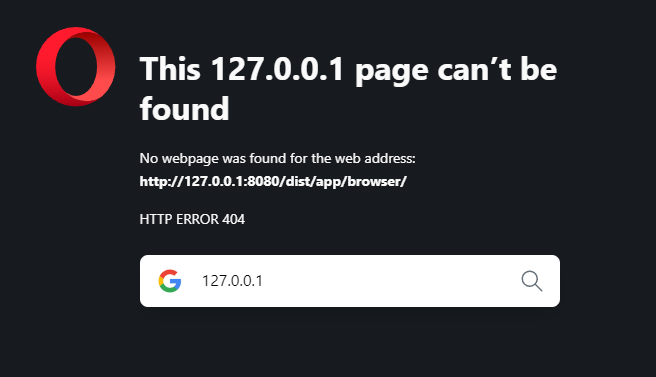

***********************************
# Adding Offline Capabilities with Service Workers

## Module Introduction

Starting with an angular example of a lot of text...

It's a "dummy text" API to get articles on your app. Index also has some special google font!

## Adding Service Workers

So what's a service worker?

A proxy between your app and the http request (catches the request, then might allow to let it leave the app?)

Not every 3rd party handles this. But this one below does: 

   ng add @angular/pwa

Downloads the Angular service worker package, and start with a preconfigured service worker!

Install a lightweight node server
    npm install -g http-server
    OR
    http-server

## Caching Assets for Offline Use

http://127.0.0.1:8081/app/dist/app/browser/

I've at least got a lead! On which folder to go to... isn't showing anything :/

dangit...

***COME BACK to this LATER. Need to catch up on other stuff***

## Caching Dynamic Assets & URLs